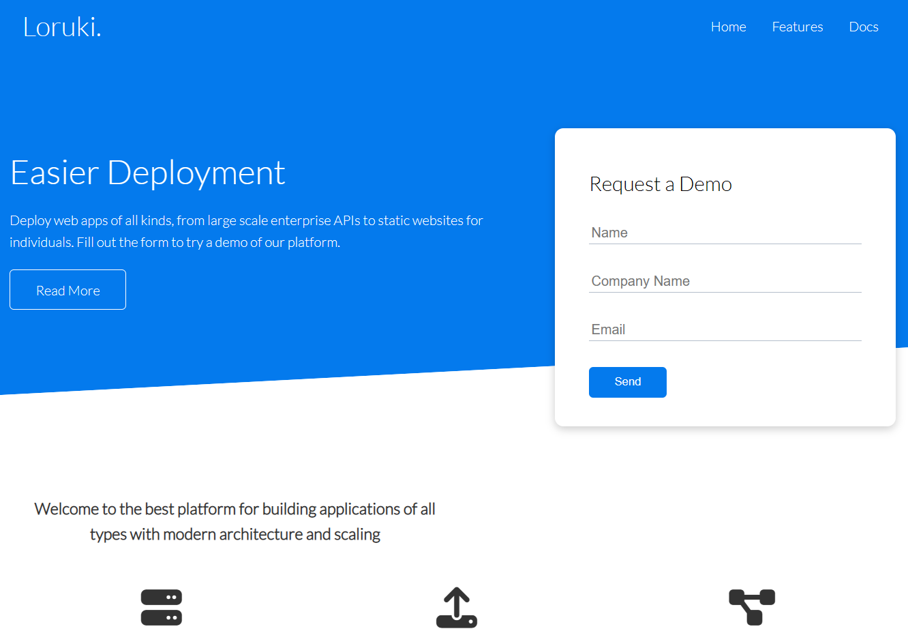

# Loruki Rebuild

Loruki is a website showcasing a fictional cloud hosting service.

## Table of contents

- [Name of project](#name-of-project)
- [General info](#general-info)
- [Screenshots](#screenshots)
- [Technologies](#technologies)
- [Setup](#setup)
- [Features](#features)
- [Contact](#contact)

## General info

The website's design and interface provide a seamless experience, making it easy
for anyone to navigate the site and understand its features either it's for
personal and business/ company uses.

## Screenshot

## Technologies

- Node 14.16.0
- VSC code
- HTML5
- SCC3

## Setup

Template from Brad Traversy

- Repository
- Create a project
- Clone this Repository
- Add group's info in the md files in planning folder directory

## Features

Loruki rebuild includes following parts

- Heading
  - Title
  - Navbar
- Main section
  - Info and picture
  - Supported laguages and logos
- Footer
  - Social Links and other resources

## Contact details

- <a href="https://github.com/AddiAlomoush">Addi</a>
- <a href="https://github.com/alisanlii">Ali</a>
- <a href="https://github.com/RabitaMaharjan">Rabita</a>
- <a href="https://github.com/Juharzeynu">Juhar</a>
